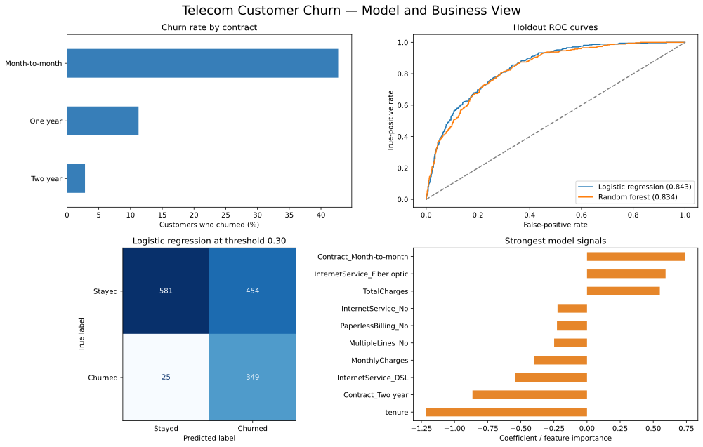

# Telecom Customer Churn Prediction

[](https://github.com/MUmairSarwar/customer-churn-prediction/actions/workflows/tests.yml)

An end-to-end machine-learning project for a practical retention question: **which customers should a telecom company contact before they leave?**

The repository uses IBM's public Telco Customer Churn sample, compares two interpretable classification baselines and selects a decision threshold using an explicit business-cost assumption. It is designed as a reproducible portfolio project rather than a one-off notebook.



## What the project does

- Cleans 7,043 customer records and handles blank `TotalCharges` values
- Separates identifiers from model features
- Uses train, validation and holdout test sets to avoid tuning on final results
- Compares class-weighted logistic regression and random forest models
- Reports ROC AUC, PR AUC, Brier score, precision, recall and F1
- Selects a retention threshold where a missed churner is assumed to cost five times as much as an unnecessary contact
- Produces a business summary, model comparison and recruiter-ready dashboard
- Runs automated tests in GitHub Actions

## Results

The selected logistic-regression model achieved **0.843 ROC AUC** and **0.633 PR AUC** on the untouched holdout set. At the validation-selected threshold of **0.30**, it identified **93.3% of churners**; precision was **43.5%**, showing the operational trade-off created by prioritising missed churners.

Run `python -m src.pipeline` to reproduce the committed results. Exact metrics are stored in [`reports/model_metrics.json`](reports/model_metrics.json). The cost ratio is a transparent demonstration assumption—not a claimed company figure.

## Run locally

```bash
python -m venv .venv
source .venv/bin/activate
pip install -r requirements.txt
python -m pytest -q
python -m src.pipeline
```

If the data file is missing, restore it from the official source with `python -m src.download_data`.

## Data source and limitations

The data comes from IBM's public [`telco-customer-churn-on-icp4d`](https://github.com/IBM/telco-customer-churn-on-icp4d/tree/master/data) sample. It is useful for demonstrating a workflow, but it is not current production data. Observed relationships are associations, not causal effects. Deployment would require current company data, monitoring, fairness review, cost validation and a controlled retention experiment.

## Author

Muhammad Umair Sarwar — Mathematics in Data Science, TU Darmstadt

Code in this repository is available under the MIT License.
